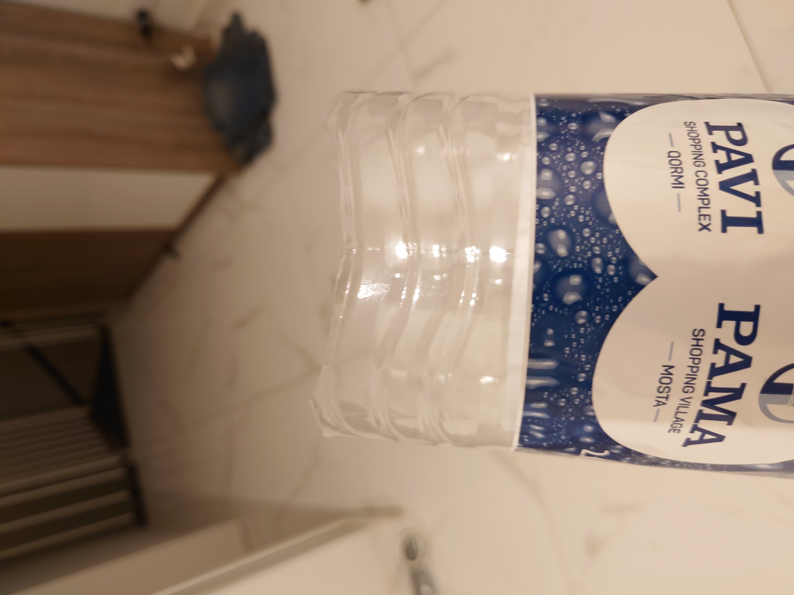
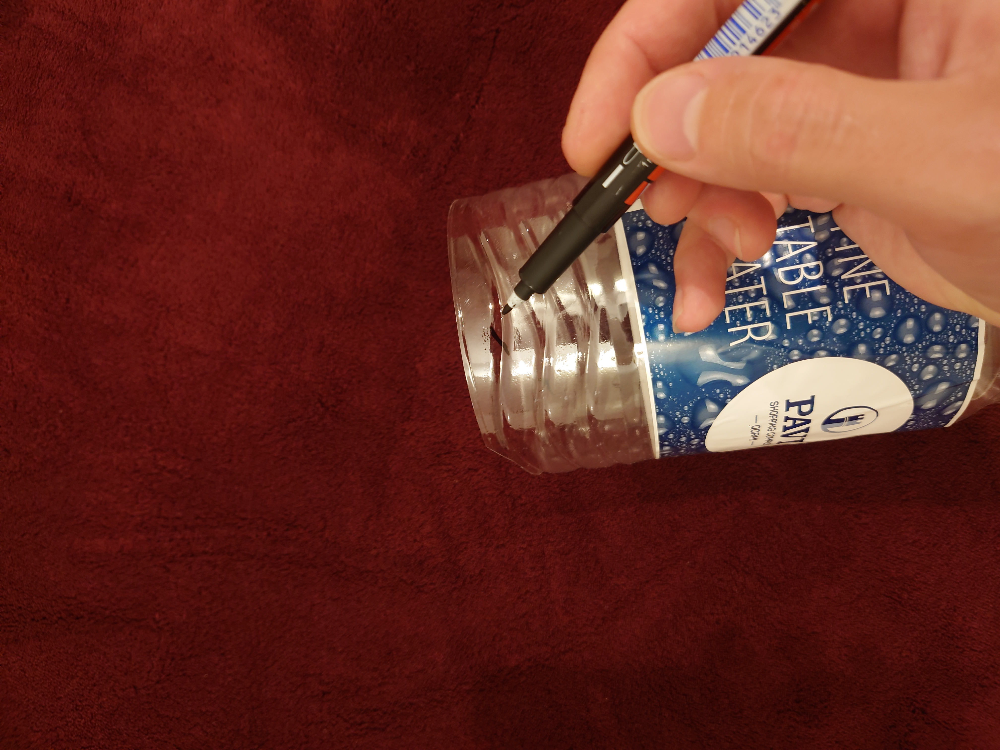
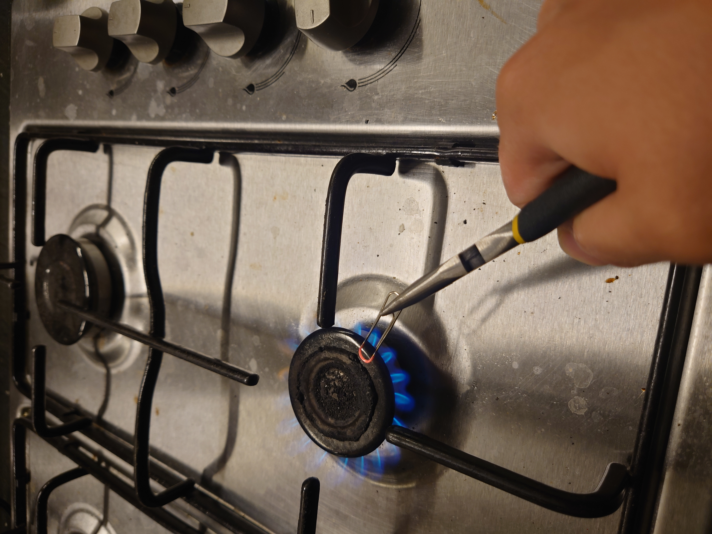
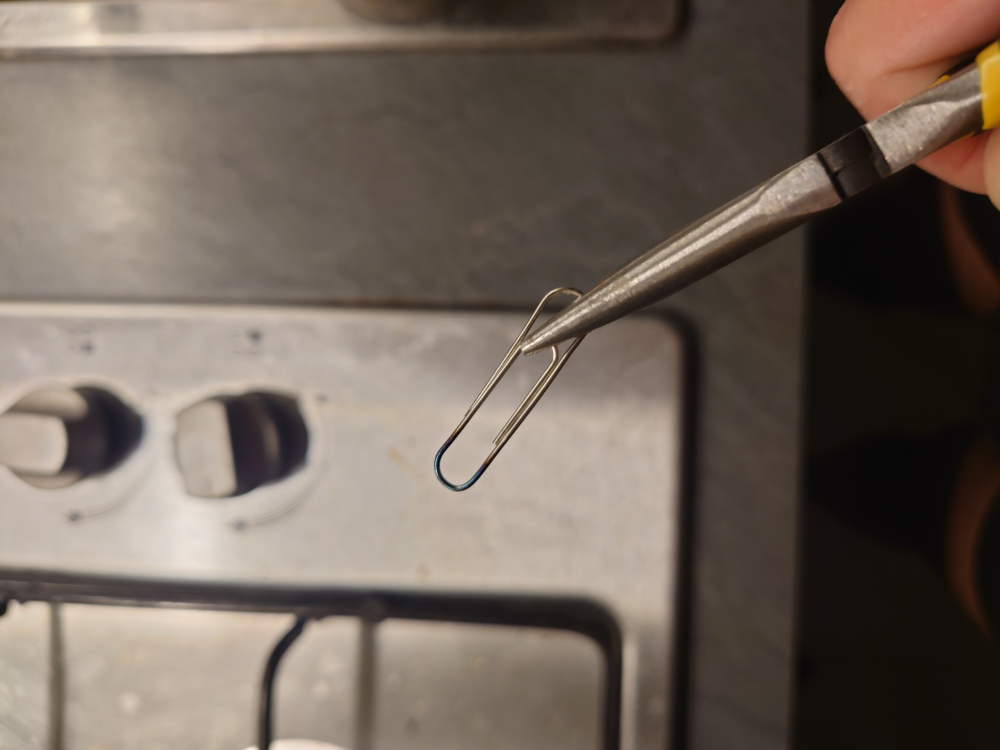
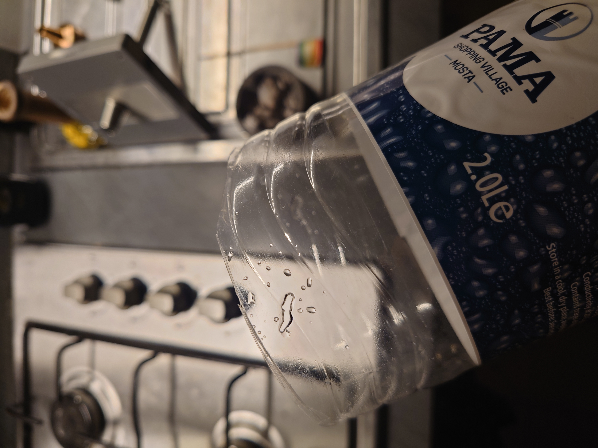

Этот документ описывает одну из версий.
Он будет полноценно опубликован и переведён по завершении каждой из стадий разработки.
Текущая стадия: исследование.

## Введение
Проект был вдохновлён и предложен оперным певцом и преподавателем Сергеем Морозовым. Причины и задачи описаны в [видео](https://www.youtube.com/watch?v=0afH_l181oE) и обсуждаются [здесь](https://pikabu.ru/story/kak_postavit_golos_za_0_rubley__izobretenie_11621399#comments).

## Изготовление
По условиям объявленного Сергеем конкурса, маска должна быть доступна к производству без требований к специальным компонентам и материалам.

#### Исходный материал
Исходя из задания, принято решение идти путём апсайклинга доступных абсолютно везде средств, то есть, той же бутылки, что и у Сергея.
Можно предложить применение строительных/медицинских масок либо 3D- печать чего-то типа [такого](https://www.thingiverse.com/thing:4225667), однако это снижает потенциальный круг пользователей.

#### Выкройка на листе А3
Добиться достаточно удобного прилегания бутылки к лицу можно добиться, обрезав край бутылки по кривой, учитывающей форму верхней челюсти и (опционально) щёк. Простейший quick-and-dirty хак был сделан таким: 

Для упрощения задачи можно напечатать на листе А3 следующий рисунок [[cutout_a3.pdf]] и вырезать по нему. Листа А4 не хватает для большинства бутылок объёмом 1.5л и более, однако можно применить раскройку [[cutout_a4.pdf]] и замкнуть недостающую линию по прямой.

Для удобства работы можно приклеить раскройку снаружи на скотч либо вставить в свёрнутом виде внутрь.

#### Рекомендации по вырезанию
Проще всего сначала отрезать изогнутую прочную часть днища бутылки острым строительным/канцелярским ножом, а потом выполнить вырезку по раскройке выше с помощью ножниц.

В примере у Сергея используется бо‘льшая по длине часть бутылки. Мне кажется более оправданным (с точки зрения дизайна других масок, баланса и удобства применения)  оставлять максимум половину длины бутылки: маска, выступающая более чем на 9-10 см, будет не слишком устойчива на лице. В такой габарит, однако, сложнее поместить эффективный звукопоглотитель.

#### Звукоизоляция
Предложенный Сергеем метод с тряпками вполне рабочий. Я доработал его, взяв в качестве ветоши разрезанную на полосы примерно 5x30 см хлопчатобумажную ткань; это позволяет не жертвовать целый шарфик или футболку, а подобрать заполнение исходя из ваших опыта, потребностей и размера маски.
В рамках улучшения можно попробовать изготовить заполнение из цельного куска EVA, применить рваную бумагу, гранулы из EVA/пенопласта: любого пористого материала, который посчитаете нужным и который будет в доступе.
#### Обработка кромок
Предложенное изначально решение с оплавлением кромок не очень сработало: в изготовленных раздуванием при нагревании бутылках много внутренних напряжений, и при попытке подплавить их они норовят сжаться назад.
Можно предложить три варианта, в зависимости от доступности компонентов:
 - Кембрик
 Кембрик – разрезанная вдоль трубка, которая легко надевается на края маски. Обычно слишком жёсток (поскольку сделан из ПВХ), но бывают и весьма удачные варианты.
 
 - Оконный уплотнитель
 В ближайшем строительном магазине могут найтись несколько разных уплотнителей для дверей и окон. Они могут различаться профилем (формой в разрезе), но, скорее всего, будут все крепиться на клеевую полосу.
 

 - Полоска ткани, нетканой или мягкой бумажной салфетки, приклеенная на скотч
Этот способ наиболее "партизанский", однако на безрыбье может сделать маску гораздо удобнее.
Сначала нужно сформировать полоску уплотнителя нужной длины (порядка 40 см). Её можно сделать из пары салфеток, сложенных до ширины в ~1.5 см, либо из мягкой х/б ткани.

Лента скотча необходимой длины крепится клейким слоем наружу на столе, и на неё приклеивается по центру мягкая полоса: по бокам должен оставаться скотч.

Наклейку на маску удобнее всего начать, приклеив центр маски к середине полосы скота на столе, и продолжить катить маску, наклеив, таким образом, наружную сторону за один оборот.

#### Опционально: крепление к голове: резинки
Этот этап не обязателен, но может помочь, если вы привыкли в маске, и хотите тренировать уже сценические выступления. Разметка для одной (два отверстия) и двух (четыре отверстия) резинок уже приведена в чертежах.
 
План предполагает применение обычных резинок*, вставленных в отверстия в маске.
Отверстия удобно выполнить разогретой на огне скрепкой, которую можно держать пассатижами (либо разогнуть скрепку и сфромировать ей "ручку", за которую удобно держать, соблюдая угол поворота – просто длинную ножку держать будет неудобно, она новорит провернуться).
 !(13_alternative_tool.jpg)(Если у вас нет небольших плоскогубцев...)
_Подобным способом я ещё с дошкольного возраста делал отверстия в пластиковых детальках._

Включаем газ, разогреваем инструмент. _Кухню заполняет сладковатый запах плавленного и чуть подожжённого PETG._  При этом не обязательно греть инструмент докрасна (и совершенно точно не надо греть пассатижи)

Твёрдо держа скрепку, делаем одно не очень быстрое, но уверенное движение. Потом есть смысл остановиться, введя петлю на 2/3 внутрь и дать скрепке остыть: при вынимании края отверстия не будут дополнительно подплавлены на обратном движении, как это получилось у меня.

#### Опционально: крепление к голове: эластичный бинт
Вместо резинок от одежды можно применить эластичный бинт. Разметка отверстий при этом меняется; удобно будет сделать пару мелких отверстий под штатное крепление бинта с цепкими лапками с каждой стороны.

## Применение
Маска надевается на лицо, закрывая рот.
Для тренировок и распевки можно применять без резинок, держа её одной рукой.
Для постоянного применения удобнее будет применить резинки, освободив руки.